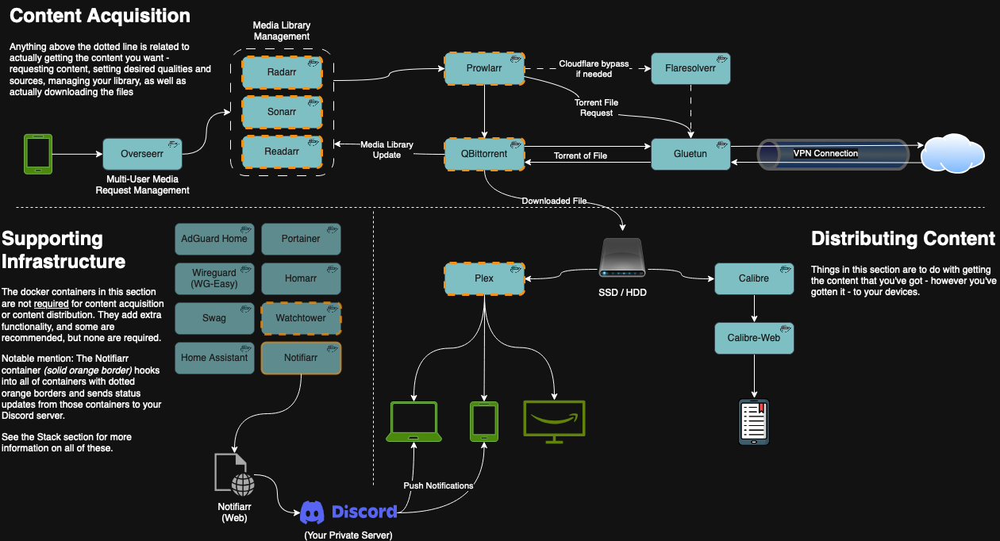
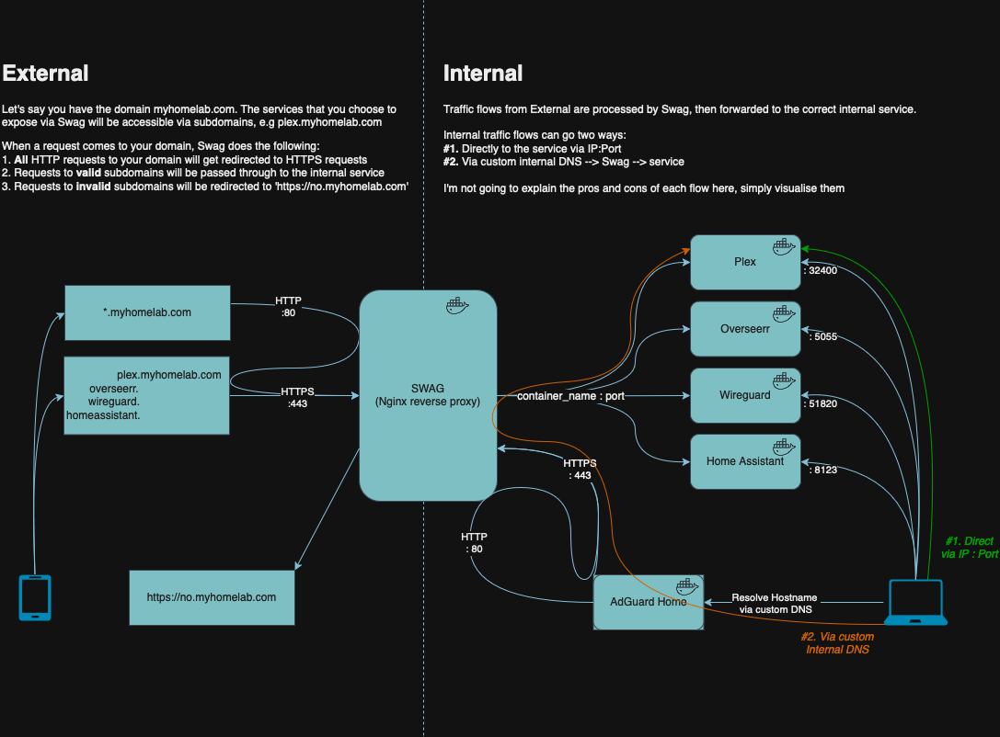

# Overview
This repo is aimed at providing an easy way of deploying all the components of a Media Management & Streaming service, mainly via the \*Arr apps as individual Docker Containers, with the intent to be as per ‘best practice’ as possible. They are also coupled in certain ways (eg. shared docker networks), which means deploying a stack individually may cause issues.
As much as possible design decisions will be explained / linked to explanations.

It consists of three Docker Stacks, as follows:
- Home Services stack: things that ideally remain active independently of the Media / eBook stacks. 
- Media stack: the media management stuff. Designed to use components of the Home Services stack for some of its functionality, but won’t break if it’s not there
- eBook stack: currently relies on the Media stack to download eBooks. Will serve existing content without Media stack being active, but won’t be able to download new content. 


## Features
- Per-service user segregation
- Secrets material stored in files accessible on a per-container basis
- Services configured by service-wide `.env` files
- Hardlinking of media for more efficient I/O operations
- Automated TRaSH Guide sync for media profiles


## Data Flows

I've put this in before describing the components in more detail as I think having a visual representation of what's going on helps promote understanding more than, well, a wall of text.

First, the data flow in the context of interactions between the containers themselves:


Second, the data flow in the context of the homelab as deployed to your home network, and accessed in and out of your home:



# Components
Also check out the [Things to note](#Things to note) section, as some of the design decisions are elaborated on there

## Home Services stack
This stack is designed to provide overarching services that will be used by various different stacks.
It should be able to run independantly of other stacks, however other stacks may rely on it

It consists of the following services:
- Swag: Reverse proxy to support easy connectivity. Also updates your dynamic DNS
- Home Assistant: Home automation system
- Homarr: Configurable home page for all the various services created across these stacks
- Wyze-bridge: Wyze camera feed aggregator. Makes video streams accessible without having to go online

## Media stack
This stack is purely for media management. It may break if the Home Services stack is not present

It consists of the following services:
- Plex: Main media server
- Tautulli: Plex media server monitoring service
- Gluetun: VPN client to provide containers secure outbound connectivity
- qBittorrent: torrent client. Relies on Gluetun
- Radarr: Automated movie management and integration with torrent client
- Sonarr: Same as radarr but for TV shows
- Prowlarr: Torrent indexers proxy
- Notifiarr: A notification aggregator, which also supports [TRaSH Guides](https://trash-guides.info/) sync for media quality profiles 

It also has the following services 'built' but not in use.
- Lidarr: Same as radarr but for Music
- sonarr_netimport: A python script to fetch TV shows from tvdb.com and add them to sonarr
- radarr_netimport: Similar to sonarr_netimport but for radarr


# Deployment / Installation

## Prerequisites
- [docker and docker-compose](https://docs.docker.com/engine/install/)
- Your own outbound VPN connection
- a....basic...knowledge of how to work in the command line, aka edit `.env` files, run shell scripts.

## Pre-deployment
Edit and then run the `initial_system_setup.sh` script in the `scripts` folder.


## Container deployment
Each of the stacks in this repo are designed to be deployed via Portainer using the [Git Repository option](https://docs.portainer.io/user/docker/stacks/add#option-3-git-repository)
This means that when a given stack - defined by a subfolder in this repo and the `docker-compose.yml` file contained within - is deployed, the `.env` file in the same folder will automatically be loaded by Portainer for that stack.

You can of course deploy them manually. Download the stack's folder, modify the `.env` file, and run with `docker compose up`

**IMPORTANT**: The `.env` file is where the bulk of your configuration should occur. 
If you need to edit the `docker-compose.yml` file outside of disabling services, it needs to be improved. Please create an issue for tracking.


## Post-deployment configuration
There is a lot to be covered here, so I'm just going to do the ol 'RTFM' thing and point you to a couple of wikis:
- [Radarr](https://wiki.servarr.com/radarr)
- [Sonarr](https://wiki.servarr.com/sonarr)
- [Prowlarr](https://wiki.servarr.com/prowlarr)

In addition, IBRACORP have done a great job on making some guides:
- [Homarr](https://docs.ibracorp.io/homarr)
- [Docker Compose](https://docs.ibracorp.io/docker-compose)
- [SWAG](https://docs.ibracorp.io/swag-2)
- [Notifiarr](https://www.youtube.com/watch?v=DCxU3Vzaz6k)


# Things to note
## VPN
This is designed to perform Torrent and File acquisition tasks via a VPN. You will need to provide that, or alternatively simply run without one. 

## Hardlinking
This setup uses Hardlinking to minimise unneccessary file I/O. The main idea of it is to have your host folder structure set up as below, and ensure that the containers have these folders [mapped as Volumes in the correct manner](https://trash-guides.info/Hardlinks/How-to-setup-for/Docker/)
```bash
data
├── torrents
│   ├── books
│   ├── movies
│   ├── music
│   └── tv
├── usenet
│   ├── incomplete
│   └── complete
│       ├── books
│       ├── movies
│       ├── music
│       └── tv
└── media
    ├── books
    ├── movies
    ├── music
    └── tv
```
See [TRaSH Guides](https://trash-guides.info/Hardlinks/Hardlinks-and-Instant-Moves/) for more info.


## Updating
Watchtower is included in order to keep containers updated. If you choose not to deploy this, the containers deployed simply won’t get automatic updates via the Watchtower mechanism. You are welcome to choose another automated update mechanism, or update the containers manually.

## User security
- Most of the containers are set up to run on the host system under their own user. This is a security-based decision, aimed at reducing the impact of any single user of the host system being compromised. If you don’t want to deal with all the users, simply run these containers as the one user, things wil still work.
- Some of the containers have to run as a privileged user; often `root`. They are called out as such, as is the reasoning. If you find a way to circumvent that need, please let me know!
- For more on this, see Docker’s [blog post](https://www.docker.com/blog/understanding-the-docker-user-instruction/) about the `USER` directive, as well as how LinuxServer.io’s docker images facilitate [setting the user that a container runs as](https://docs.linuxserver.io/general/understanding-puid-and-pgid/)

## Discord Notifications
To keep track of what’s going on with the whole setup, Notifiarr will send messages to a Discord server of your configuration. This requires you to set up a Discord server (free), and run a Notifiarr container linked to a Notifiarr account.
It can be configured as you desire, eg. give updates on new or deleted media content, updated containers, when a Plex stream starts / stops (useful if your media library is shared amongst multiple users)

## Media Quality
The quality of the media you download (720p, 1080p, 2160p etc.) depends on the Quality Profiles (QPs) you configure. This is a [deep rabbit hole to go down](https://trash-guides.info/Radarr/radarr-setup-quality-profiles/), and I’ve chosen to use TRaSH Guides’ regularly updated QPs instead of trying to maintain my own.

I’ve also chosen to buy a $10 AUD license for Notifiarr, which automates the job of keeping my QPs in sync. I am aware this could be done with [Recyclarr](https://trash-guides.info/Recyclarr/) for free, however I am already using Notifiarr for many other things and figured $10 is the least I can do to support the devs.

You do not need to do this. You can simply 

## RSS Downloads
Certain things don’t support proper episode downloading - namely sports. I like F1 (and absolutely hate Kayo / Foxtel), and using RSS feeds allows me to automate *most* of the work of acquiring the content. For more details, read [RSS Downloads.md](RSS_Downloads.md)