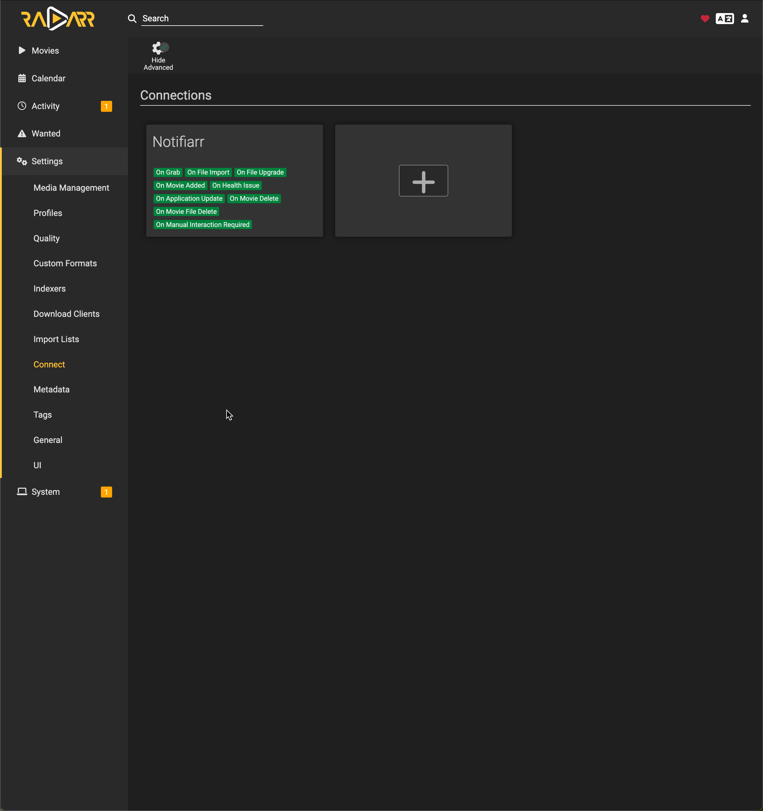

# Table of Contents
- [Table of Contents](#table-of-contents)
- [Readme for Radarr / Sonarr app configuration](#readme-for-radarr--sonarr-app-configuration)
- [Screens](#screens)
  - [Media Management](#media-management)
  - [Profiles](#profiles)
  - [Quality](#quality)
  - [Custom Formats](#custom-formats)
  - [Indexes](#indexes)
  - [Download Clients](#download-clients)
  - [Import Lists](#import-lists)
  - [Connect](#connect)
  - [Metadata](#metadata)
  - [Tags](#tags)
  - [General](#general)
  - [UI](#ui)

# Readme for Radarr / Sonarr app configuration

This is intended as reference for configuring the Radarr **app** post it being deployed via the docker containers.
Initially the configuration of the -arr apps, and how they all interact, can be somewhat overwhelming. 
There exists the excellent [Radarr Wiki](https://wiki.servarr.com/radarr) which is of course the ultimate reference for all of this, but what I've done here is simply dump screenshots of my setup to provide: 

- just base config, so you can see how **I** have by apps set up
- context about which screens relate to, or are set / configured by, which other applications in the whole setup
- context about what specific values are set, and why

> Note: most of these settings will apply to Sonarr too

# Screens

## Media Management

## Profiles

## Quality

## Custom Formats

## Indexes

## Download Clients

## Import Lists

## Connect

## Metadata
_Metadata - not configured (yet)_

## Tags
_Tags - not configured (yet)_

## General

## UI
_UI - no screeshot provided, configure as you desire_